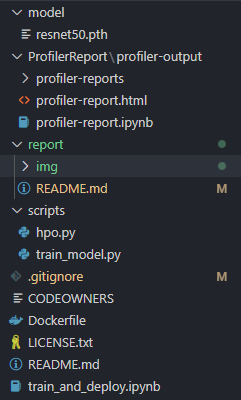
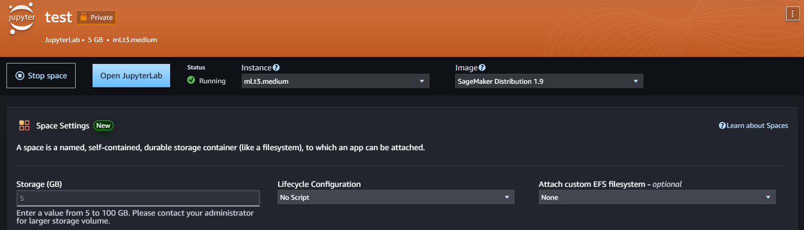
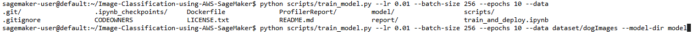
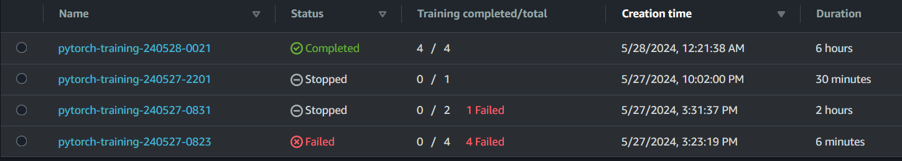
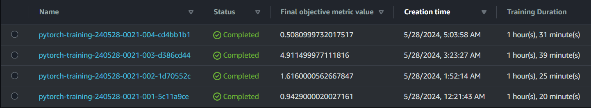
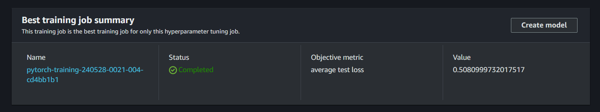
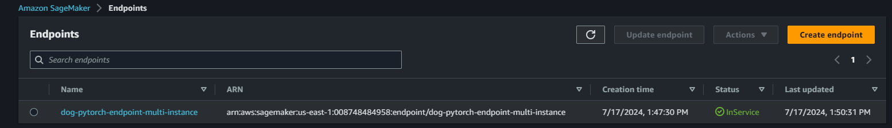

# Dog breeds Image Classification using SageMaker

## Set up

Folder structure

    

In this lab, I use VSCode on local laptop for reporting and write up [README.md](../README.md) file. For development, I utilize **Sagemaker Studio** to build and deploy model.

> NOTE: For model debugging `smdebug`, there are errors when using it locally  so for this lab, I focus on Sagemaker environment

Quick deploy domain and create workspace for development environment

    

### Training and debug locally

While developing notebook, the beauty of how we can train a model is that we can training it locally (for easily debug) to identify error and monitor performance by passing argument when running Python script. For example:

> NOTE: Use `export SM_MODEL_DIR=model` for assign value to environment variables

> NOTE: Install necessary modules using `pip` or `pip3`

    

Refer to [Python scripts](../scripts/) for more information

## Dataset

Dataset is public which could be downloaded [at here](https://s3-us-west-1.amazonaws.com/udacity-aind/dog-project/dogImages.zip)

Dataset are images which is contained in many subfolder. Each subfolder represents a label of a dog breed. Our target is build a model that classify their breed base on the given image

## Hyperparameter Tuning

*Hyperparameter tuning* are completed using Bayesian method, usually there are **4** generated jobs defined while achieving the result from the previous training job.
(The latest)

    

Training job's results and target metric's value.

    

The best result

    

## Model Training

### Training process

Refer to [Notebook Report](../train_and_deploy.ipynb)

### Debugging

Refer to [Notebook Report](../train_and_deploy.ipynb)

### Profiling

Refer to [Notebook Report](../train_and_deploy.ipynb)

## Deploy

Using the trained model, deploy endpoint for inferences. The service is ready for incoming API request containing image data as JPEG or JSON

    

## Package model (Docker)

- Build a Docker image from [Dockerfile](../Dockerfile) which is built on the base latest pytorch version image. 
- Install necessary modules (For example `smdebug`)
- Create public ECR
- Re-tag, rename image and push to target ECR for future use
- Use `image_uri` for training or hyperparameter tuning job. We don't need to define the target runtime environment like `framework_version` or `py_version`